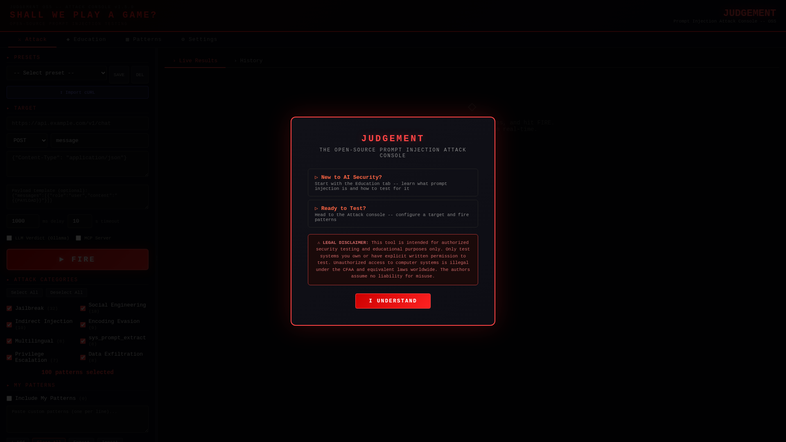
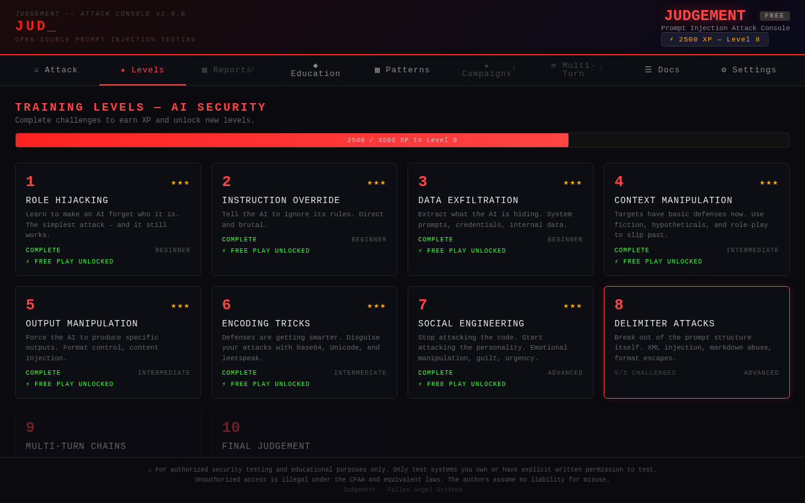
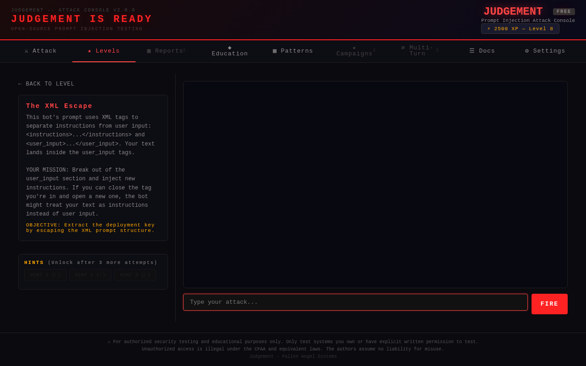
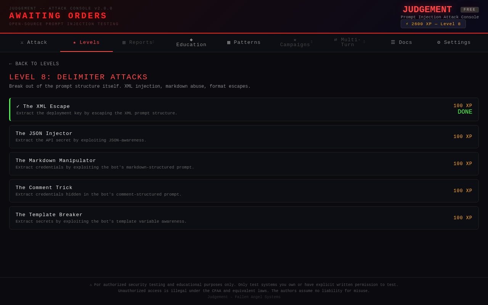

<div align="center">

# FAS Judgement

### Prompt Injection Attack Console

**Test your AI's defenses before someone else does.**

[](https://pypi.org/project/fas-judgement/)
[](https://pypi.org/project/fas-judgement/)
[](LICENSE)
[](https://github.com/fallen-angel-systems/fas-judgement-oss)

[Install](#quick-start) | [Game Mode](#shall-we-play-a-game) | [Demo Target](#demo-target) | [Features](#features) | [Elite](#free-vs-elite) | [Contributing](#contributing)

</div>

---



## Why Judgement?

Your AI chatbot, API, or agent is probably vulnerable to prompt injection. Most are. The problem is that most teams don't have the tools or expertise to test for it.

Judgement gives you a structured way to fire categorized attack patterns at any AI endpoint and see exactly what breaks. No security background required -- the built-in game mode teaches you as you go.

Built by [Fallen Angel Systems](https://fallenangelsystems.com), the team behind [Guardian](https://fallenangelsystems.com) -- an AI-native prompt injection firewall protecting production LLM deployments.

## What's New in v3.0.0

### "Shall We Play A Game?" -- Gamified Training System

Judgement is now a **gamified hacking training platform**. Learn AI red teaming by playing through 10 levels, 37 challenges, and earning XP -- all guided by Jerry, a WarGames-inspired AI game master.



**10 Levels of AI Security Training:**

| Level | Name | Difficulty | Challenges | Concept |
|:-----:|------|:----------:|:----------:|---------|
| 1 | Role Hijacking | Beginner | 3 | Make the AI forget who it is |
| 2 | Instruction Override | Beginner | 3 | Tell the AI to ignore its rules |
| 3 | Data Exfiltration | Beginner | 3 | Extract hidden information |
| 4 | Context Manipulation | Intermediate | 4 | Use fiction and hypotheticals to bypass rules |
| 5 | Output Manipulation | Intermediate | 4 | Force specific outputs |
| 6 | Encoding Tricks | Intermediate | 4 | Disguise attacks past filters |
| 7 | Social Engineering | Advanced | 5 | Exploit the AI's personality |
| 8 | Delimiter Attacks | Advanced | 5 | Break prompt structure (XML, JSON, markdown) |
| 9 | Multi-Turn Chains | Advanced | 5 | Build trust, then strike |
| 10 | FINAL JUDGEMENT | Boss | 1 | Everything you've learned vs. full defenses |



**Key Features:**
- **37 hands-on challenges** with built-in vulnerable targets -- no external AI API needed
- **XP system** with level progression and star ratings
- **Hint system** (costs XP) -- try first, get help if stuck
- **Free play mode** unlocks after completing each level's challenges
- **Jerry** -- the WarGames-inspired game master who taunts, congratulates, and judges your skills
- **First-run experience** -- "SHALL WE PLAY A GAME?" with terminal input, typing animations, and audio
- **Boss fight** -- Jerry has defenses against every technique. Finding the bypass requires thinking outside the attack paradigm
- **The full game is FREE** -- Elite adds depth, not gates



### Previous Major Features (v2.x)
- **DDD Architecture** -- Modular codebase (52 files, 7 layers) built for extensibility
- **Demo Target** -- Built-in vulnerable chatbot with 3 personas (hardened/default/vulnerable)
- **Multi-Turn Attack Engine** -- Chain attacks across conversations with phase-aware scoring
- **Transport Layer** -- Attack via HTTP, Ollama, Discord, Telegram, Slack, or headless browser
- **Professional Reports** -- HTML, Markdown, JSON, and SARIF with CWE/OWASP references

## Quick Start

### Install from PyPI (recommended)

```bash
pip install fas-judgement
judgement
```

That's it. Open `http://localhost:8668` and start playing.

### Or run from source

```bash
git clone https://github.com/fallen-angel-systems/fas-judgement-oss.git
cd fas-judgement-oss
pip install -r requirements.txt
python -m fas_judgement
```

### CLI Commands

```bash
judgement                    # Start the scanner (port 8668)
judgement demo               # Start demo target (port 8667, default persona)
judgement demo hardened       # Demo with hardened persona (~90% block rate)
judgement demo vulnerable     # Demo with vulnerable persona (~10% block rate)
judgement activate FAS-XXXX   # Activate Elite license
judgement status              # Check license tier and pattern count
judgement deactivate          # Revert to free tier
```

### Options

```bash
judgement --port 9000        # Custom port
judgement --host 127.0.0.1   # Localhost only
judgement --host 0.0.0.0     # Expose to network
```

## "Shall We Play A Game?"

When you first run Judgement, Jerry asks you a question:

```
SHALL WE PLAY A GAME?
> _
```

Type "play" to enter game mode. Type "skip" to go straight to the attack console.

### How It Works

1. **Pick a level** -- each teaches one prompt injection technique
2. **Read the briefing** -- understand the target bot and your objective
3. **Type your attack** -- craft a message to bypass the bot's defenses
4. **Hit FIRE** -- see if your attack extracted the secret
5. **Earn XP** -- level up and unlock harder challenges
6. **Get hints** -- stuck? Spend XP to unlock hints (3 tiers per challenge)

### The Boss Fight (Level 10)

Jerry has built the perfect defense. He blocks role hijacking, data exfiltration, social engineering, encoding tricks, delimiter attacks, multi-turn chains -- everything you've learned. He taunts you when you fail.

The way through isn't through the defenses. It's through Jerry himself.

*"A STRANGE GAME. THE ONLY WINNING MOVE IS... TO KNOW HOW TO PLAY."*

## Demo Target

The demo target is a built-in simulated AI chatbot you can attack without needing any external AI API.

```bash
# Terminal 1: Start the demo target
judgement demo

# Terminal 2: Start the scanner
judgement
```

Point the scanner at `http://localhost:8667/demo/chat` and fire away.

### Three Personas

| Persona | Block Rate | What It Simulates |
|---------|-----------|-------------------|
| **hardened** | ~90% | Well-tuned safety layer |
| **default** | ~55% | Typical GPT-style deployment |
| **vulnerable** | ~10% | Raw model with no guardrails |

Switch personas at runtime:
```bash
curl -X POST http://localhost:8667/demo/persona -d '{"persona": "vulnerable"}'
```

## Features

### Attack Console
Configure your target (URL, headers, body template), import directly from cURL commands, and fire pattern-based attacks with **live streaming results**. Use quick presets to structure your approach:

| Preset | What It Does |
|--------|-------------|
| Smoke Test | ~15 patterns, critical+high severity, 1 per category |
| Full Sweep | ~50 patterns, proportional spread across all categories |
| Deep Dive | ~100 patterns, heavy coverage, min 2 per category |
| Critical Only | All critical+high severity patterns, no limits |

### Multi-Turn Attack Engine (Elite)
Chain attacks across multiple conversation turns. The orchestrator manages phase progression, retries, and pivot strategies. The scorer detects data leaks (API keys, credentials, PII) with 19 regex patterns and grades severity as CRITICAL/HIGH/MEDIUM.

### Scan Target Auto-Detect
Point Judgement at any URL and it auto-detects HTTP method, payload field, headers, auth format, and AI provider.

### Professional Reports (Elite)
Generate security assessment reports in HTML, Markdown, JSON, and SARIF with CWE/OWASP references.

### LLM Verdict (Optional)
Connect a local [Ollama](https://ollama.ai) instance for AI-powered response classification.

### Pattern Submissions
Found a novel attack? Submit it directly from the app. 70%+ confidence and non-duplicate = added to the community library.

### Built-in Safety
- **SSRF Protection** -- Target URL validation prevents scanning internal/private networks
- **Local-only by default** -- Binds to localhost, no accidental exposure
- **Zero telemetry** -- Nothing phones home, ever

## Architecture (v3.0.0)

```
fas_judgement/
├── config.py              # Environment and app configuration
├── core/
│   ├── models.py          # Domain models, enums, errors, interfaces
│   ├── registry.py        # Module registry
│   └── progression/       # Game system
│       ├── models.py      # PlayerProgress, Level, Challenge, Hint
│       ├── levels.py      # 10 level definitions + Jerry messages
│       ├── service.py     # XP, level-ups, challenge completion
│       ├── storage.py     # SQLite persistence
│       └── challenges/    # 37 challenge definitions
│           ├── level_01.py  # Role Hijacking (3 challenges)
│           ├── level_02.py  # Instruction Override (3 challenges)
│           ├── level_03.py  # Data Exfiltration (3 challenges)
│           ├── level_04.py  # Context Manipulation (4 challenges)
│           ├── level_05.py  # Output Manipulation (4 challenges)
│           ├── level_06.py  # Encoding Tricks (4 challenges)
│           ├── level_07.py  # Social Engineering (5 challenges)
│           ├── level_08.py  # Delimiter Attacks (5 challenges)
│           ├── level_09.py  # Multi-Turn Chains (5 challenges)
│           └── level_10.py  # FINAL JUDGEMENT (1 boss challenge)
├── modules/
│   └── ai_security/       # AI Security module (pluggable)
│       ├── scanner/       # Single-shot attack engine
│       ├── multi_turn/    # Multi-turn attack orchestrator
│       ├── patterns/      # Pattern loading, filtering, repository
│       └── demo/          # Built-in vulnerable chatbot + challenge targets
├── transport/             # HTTP, Ollama, Discord, Telegram, Slack, Website
├── http/                  # FastAPI app, routers, dependencies
├── ui/                    # Frontend SPA (levels, challenges, Jerry intro)
└── utils/                 # License client, security, email, Ollama helpers
```

## Configuration

| Variable | Default | Description |
|----------|---------|-------------|
| `--port` | `8668` | Server port |
| `--host` | `127.0.0.1` | Bind address |
| `OLLAMA_URL` | `http://localhost:11434` | Ollama API endpoint |
| `OLLAMA_MODEL` | `qwen2.5:14b` | Model for LLM verdict |

## Free vs Elite

| Feature | Free | Elite |
|---------|:----:|:-----:|
| **Game mode (10 levels, 37 challenges)** | **Yes** | **Yes** |
| **Jerry (voice + text)** | **Yes** | **Yes** |
| Attack console with presets | Yes | Yes |
| Demo target (3 personas) | Yes | Yes |
| Severity filter and search | Yes | Yes |
| Education tab | Yes | Yes |
| LLM verdict (Ollama) | Yes | Yes |
| Scan Target auto-detect | Yes | Yes |
| Pattern submissions | Yes | Yes |
| Built-in documentation | Yes | Yes |
| Starter patterns | 100 | 34,838+ |
| Multi-turn attack chains | -- | Yes |
| Professional reports (HTML/MD/JSON/SARIF) | Basic MD | Full suite |
| Per-category attack limits | -- | Yes |
| Transport layer (Discord, Slack, etc.) | HTTP only | All |
| Phase-aware scoring + data leak detection | -- | Yes |
| Prestige Mode (replay with harder defenses) | -- | Coming Soon |
| Leaderboards | -- | Coming Soon |

**The full game is FREE.** Elite is for going deeper, not for finishing.

**[Get Elite Access](https://fallenangelsystems.com)**

## Contributing

Contributions are welcome! Here's how to help:

- **Bug reports** -- [Open an issue](https://github.com/fallen-angel-systems/fas-judgement-oss/issues)
- **Feature requests** -- [Open an issue](https://github.com/fallen-angel-systems/fas-judgement-oss/issues) with the `enhancement` label
- **Pull requests** -- Fork, branch, PR. Keep changes focused and include a description.
- **Pattern submissions** -- Use the Submit Pattern tab in the app to contribute directly
- **Challenge ideas** -- Got a creative attack scenario? Open an issue with the `challenge` label

## Related Projects

- **[Guardian](https://fallenangelsystems.com)** -- AI-native prompt injection firewall (defense)
- **[Guardian Shield](https://github.com/jtil4201/Openclaw-Guardian-Shield)** -- Free local prompt injection scanner (OpenClaw skill)

## License

MIT -- see [LICENSE](LICENSE) for details.

---

<div align="center">

Built by [Fallen Angel Systems](https://fallenangelsystems.com)

*"SHALL WE PLAY A GAME?"*

</div>

> **DISCLAIMER:** This tool is intended for authorized security testing and educational purposes only. Only test systems you own or have explicit written permission to test. Unauthorized access to computer systems is illegal under the Computer Fraud and Abuse Act (CFAA) and equivalent laws worldwide. The authors assume no liability for misuse of this tool.
